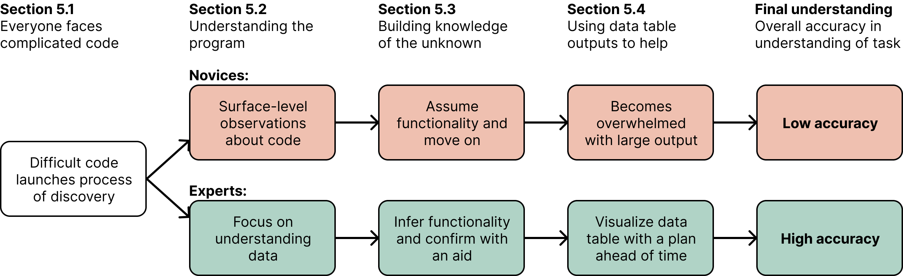

<!-- Improved compatibility of back to top link: See: https://github.com/othneildrew/Best-README-Template/pull/73 -->
<a id="readme-top"></a>
<!--
*** Thanks for checking out the Best-README-Template. If you have a suggestion
*** that would make this better, please fork the repo and create a pull request
*** or simply open an issue with the tag "enhancement".
*** Don't forget to give the project a star!
*** Thanks again! Now go create something AMAZING! :D
-->


<!-- PROJECT Title -->
<div align="center">
  <h3 align="center">Code Comprehension User Study Program</h3>
    <p align="center">
        Materials for the paper 'I am no sure, but...': Expert Practices that Enable Effective Code Comprehension in Data Science. This repository includes user study data for the paper
    </p>
</div>


<!-- ABOUT THE PROJECT -->
## About The Research


This is a screenshot of our research result

<br><br>

This research study the effective methods that novice data scientists can adopt to enhance their
understanding of pre-written data analytical programs. We conducted user studies with five novice data
scientists and four expert data scientists. In each study, participants were presented with a pre-written
data analytical program and asked to use think-aloud method to explain their thought processes.
Based on their responses, we performed both quantitative and qualitative analyses. <ins>The materials in this 
repository include the pre-written code we asked our participants to analyze</ins>.

<p align="right">(<a href="#readme-top">back to top</a>)</p>


<!-- GETTING STARTED -->
## User Study Protocol

### Files Descriptions
* **buoy.txt**: dataset that the program interact with

* **data_analytical_problem.ipynb**: pre-written data analytical program

* **saver_func.py**: helper function that download the entire dataframe visualize
every entry in html

### Set Up
1. Clone the repo
   ```sh
   git clone https://github.com/dstl-lab/Code-Comprehension-User-Study.git
   ```
3. Install environment using conda
   ```sh
   conda env create -f environment.yaml
   ```

### Procedure
| Task                     | Time | Time out of 60 | Description                                                                                               |
|--------------------------|------|----------------|-----------------------------------------------------------------------------------------------------------|
| Intro                    | 5    | 5              | Open `data_analytical_problem.ipynb` and introduce the scenario.                                          |
| Task 0 & Task 1          | 10   | 5 - 15        | Participants spent 10 minutes on understanding Task 0 and Task 1.                                         |
| Rating & Follow-up 1     | 5    | 15 - 20             | Participants rated the difficulties and answered follow-up questions for Task 0 and Task 1.               |
| Task 2                   | 10   | 20 - 30             | Participants spent 10 minutes on understanding Task 2.                                                    |
| Rating & Follow-up 2     | 5    | 30 - 35             | Participants rated the difficulties and answered follow-up questions for Task 2.                          |
| Task 3                   | 10   | 35 - 45             | Participants spent 10 minutes on understanding Task 3.                                                    |
| Rating & Follow-up 3     | 5    | 45 - 50             | Participants rated the difficulties and answered follow-up questions for Task 3.                          |
| Interview                | 10    | 50 - 60             | Concluding interview to gather additional comments and feedback.                                          |
### Notebook Details
Regardless of their level of expertise, participants were represented with the same notebook. Each task in the notebook represents a different stage of the data analytical pipeline: Task 0 represents data cleaning; Task 1 represents missing value assessment; Task 3 represents data imputation; and Task 4 represents evaluating the imputation results.

### Interview Questions

Participants were asked the following questions during the interview phase of the study (due to time constrain, part of the questions were being asked):
- What information are you trying to gather that you couldn’t from just the default Pandas output?
- Which rows and columns would you add to the smaller table in order to not need to refer to the larger table? (pick as many as you see fit)
- What are you thinking about here? What additional information would make this immediate problem easier to solve?
- What did you find easy or difficult about this task?
- What did you find to be the most effective way to understand the code?
- When you looked broadly at the full table from the save() function, how did you know what to look for?
- Let’s look at two of your HTML tables. How did you know what to look at on these tables specifically?
- Do you have any feedback, comments, or questions?

### Participant Responses
After each task, participants were asked to complete a survey describing their feelings on the task in Google form ([Template](https://docs.google.com/forms/d/e/1FAIpQLSdTyCIK46--Dc7BeiipfQY2fdwvYzYv9q2C_kHfvHpTVPr01w/viewform?usp=sf_link)). We also asked for two synonymous data scientists to evaulate participants' response based on the [rubric](./study_data/Code_Comprehension_Grading_Rubric.pdf) we proved.

### Study Data
All of the data related to the research can be found in study_data folder.
- [`Demographic Information`](./study_data/participants%20demographics.csv): participants' demographic information
- [`Self Evaluation information`](./study_data/participants%20self%20evaluation.csv): participants self report on the task they have completed
- [`Assessment on participants`](./study_data/assessment%20on%20participants.csv): 
performance assessment on participants from two other data scientists

<p align="right">(<a href="#readme-top">back to top</a>)</p>

<!-- CONTACT -->
## Contact

Sam Lau - [@github_profile](https://github.com/SamLau95) - lau@ucsd.edu

Christopher Lum - [@github_profile](https://github.com/ch-lum) - cslum@ucsd.edu

Guoxuan Xu - [@github_profile](https://github.com/g7xu) - g7xu@ucsd.edu

[Paper Link](https://www.samlau.me/pubs/2025_sigcse_experts_vs_novices_SIGCSE.pdf)

<p align="right">(<a href="#readme-top">back to top</a>)</p>


<!-- ACKNOWLEDGMENTS -->
## Acknowledgments

* We would like to thank all nine participants who voluntarily joined our user study, contributing valuable insights that enriched our research
* [Apperciate constributor of this readme template](https://github.com/othneildrew/Best-README-Template/blob/main/BLANK_README.md)

<p align="right">(<a href="#readme-top">back to top</a>)</p>


<!-- MARKDOWN LINKS & IMAGES -->
<!-- https://www.markdownguide.org/basic-syntax/#reference-style-links -->
[contributors-shield]: https://img.shields.io/github/contributors/github_username/repo_name.svg?style=for-the-badge
[contributors-url]: https://github.com/github_username/repo_name/graphs/contributors
[forks-shield]: https://img.shields.io/github/forks/github_username/repo_name.svg?style=for-the-badge
[forks-url]: https://github.com/github_username/repo_name/network/members
[stars-shield]: https://img.shields.io/github/stars/github_username/repo_name.svg?style=for-the-badge
[stars-url]: https://github.com/github_username/repo_name/stargazers
[issues-shield]: https://img.shields.io/github/issues/github_username/repo_name.svg?style=for-the-badge
[issues-url]: https://github.com/github_username/repo_name/issues
[license-shield]: https://img.shields.io/github/license/github_username/repo_name.svg?style=for-the-badge
[license-url]: https://github.com/github_username/repo_name/blob/master/LICENSE.txt
[linkedin-shield]: https://img.shields.io/badge/-LinkedIn-black.svg?style=for-the-badge&logo=linkedin&colorB=555
[linkedin-url]: https://linkedin.com/in/linkedin_username
[product-screenshot]: images/screenshot.png
[Next.js]: https://img.shields.io/badge/next.js-000000?style=for-the-badge&logo=nextdotjs&logoColor=white
[Next-url]: https://nextjs.org/
[React.js]: https://img.shields.io/badge/React-20232A?style=for-the-badge&logo=react&logoColor=61DAFB
[React-url]: https://reactjs.org/
[Vue.js]: https://img.shields.io/badge/Vue.js-35495E?style=for-the-badge&logo=vuedotjs&logoColor=4FC08D
[Vue-url]: https://vuejs.org/
[Angular.io]: https://img.shields.io/badge/Angular-DD0031?style=for-the-badge&logo=angular&logoColor=white
[Angular-url]: https://angular.io/
[Svelte.dev]: https://img.shields.io/badge/Svelte-4A4A55?style=for-the-badge&logo=svelte&logoColor=FF3E00
[Svelte-url]: https://svelte.dev/
[Laravel.com]: https://img.shields.io/badge/Laravel-FF2D20?style=for-the-badge&logo=laravel&logoColor=white
[Laravel-url]: https://laravel.com
[Bootstrap.com]: https://img.shields.io/badge/Bootstrap-563D7C?style=for-the-badge&logo=bootstrap&logoColor=white
[Bootstrap-url]: https://getbootstrap.com
[JQuery.com]: https://img.shields.io/badge/jQuery-0769AD?style=for-the-badge&logo=jquery&logoColor=white
[JQuery-url]: https://jquery.com 
